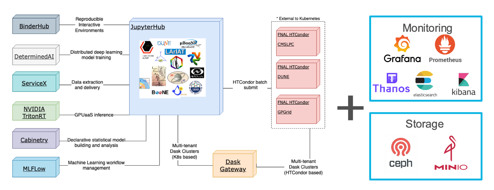

# Introduction

EAF is a web-based platform designed for Python analysis and ML tasks. It utilises container-based infrastructure, distinguishing it from traditional virtual machines. This approach allows underlying hardware resources to be swapped without breaking the container, providing "elasticity".

## Navigation

- Next: [Accessing EAF](02-AccessingEAF.md)
- [Back to Main](../README.md)