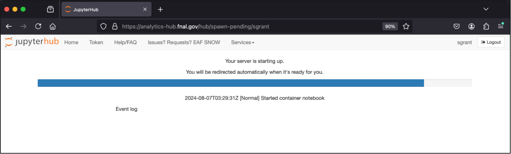

# Starting an EAF Server

1. Navigate to [analytics-hub.fnal.gov](https://analytics-hub.fnal.gov)
2. Sign in with your Fermilab Services (SSO) account
3. Click "Start My Server"
4. In the Server Options:
   - Go to the "FIFE" server box
   - Click "CPU Interactives"
   - Select "AL9"
   - Scroll to bottom and click "Start"

The server may take a few minutes to initialise.

## Navigation

- Previous: [Accessing EAF](02-AccessingEAF.md)
- Next: [Navigating JupyterHub](04-JupyterHub.md)
- [Back to Main](../README.md)