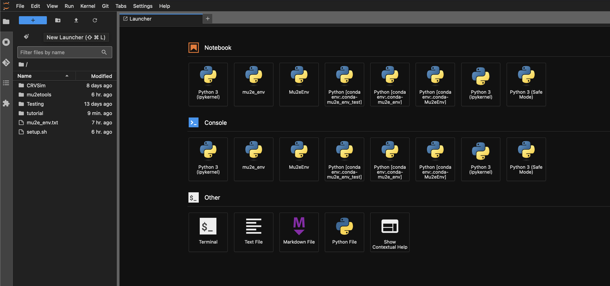

# Navigating EAF

Upon loading, you should land on a `JupyterHub` launcher page that offers a suite of applications:

- Terminal
- Python notebook  
- Text editor
- Interactive Python console

## Directory Access

Your user area will be automatically created in `/home` with access to:

- `/exp/mu2e/app`
- `/exp/mu2e/data`
- `/pnfs` (possible via `xroot`, see [`anapytools`](07-anapytools.md))

You can test this by starting a terminal and running `ls /exp/mu2e`. 

## Resources

Available resources per user:
- 8 guaranteed cores
- 64 GB memory
- 23 GB storage

## Navigation

- Previous: [Starting an EAF Server](03-StartingAServer.md)
- Next: [Using Conda/Mamba](05-CondaMamba.md)
- [Back to Main](../README.md)