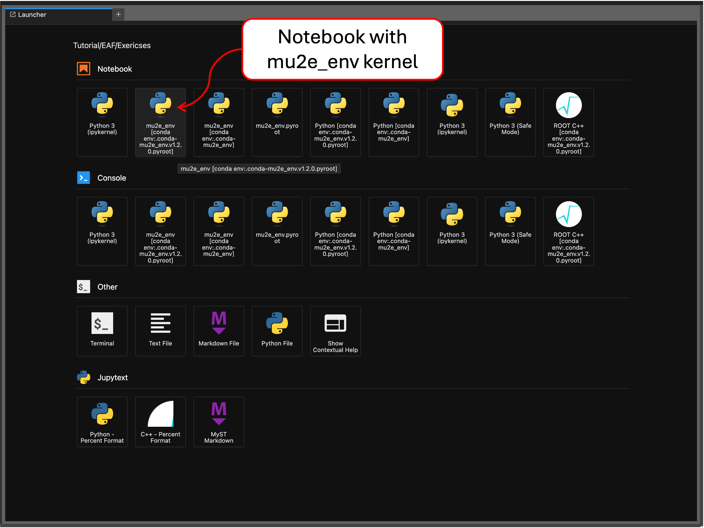
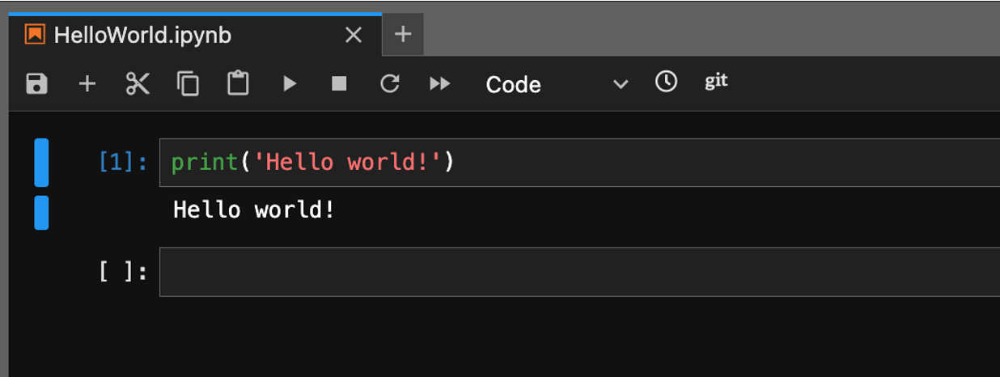

# Exercise: "Hello world!" 

If you have been following the steps in the previous sections, you should now have a running EAF server and access to the `mu2e_env` Python environment. 

## Starting a notebook

To start writing and running analysis code interactively, navigate to the launcher page by pressing the "+" button on the top-left of the screen. Then, select the "Notebook" with the kernel called `mu2e_env`.



## Managing your files 

This will create a new file named `Untitled.ipynb` in your current directory, which you can see by looking at explorer tab on the left. To rename your notebook, right-click on the file and click "Rename". 

You can also do this using `mv` from your terminal tab. 


## Running code

To starting running code in your notebook, click on the first "cell" and type 

```python 
print('Hello world!')
```
To run your cell, either press the "play" button or use `Shift+Return` while the cell is selected. 

Note that attempts to run code and import modules may run slowly on the very first try. Jupyter needs time to connect to the kernel and Python needs time to compile and cache `.pyc` files. Following attempts will be much faster. 



## Navigation

- Previous: [The Mu2e Python environment](06-TheMu2eEnvironment.md)
- Next: [pyutils](08-pyutils.md)
- [Back to Main](../README.md)