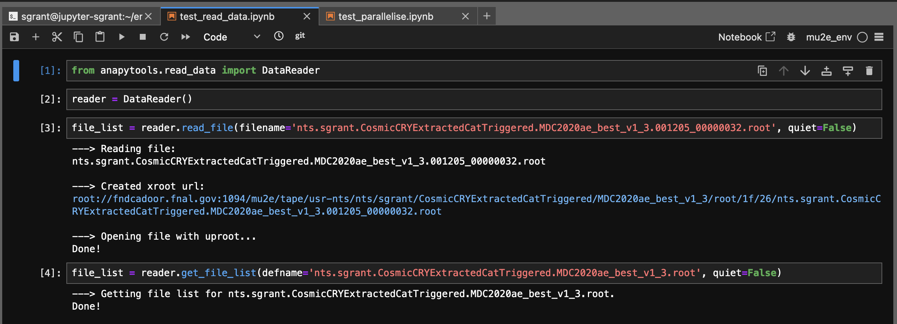
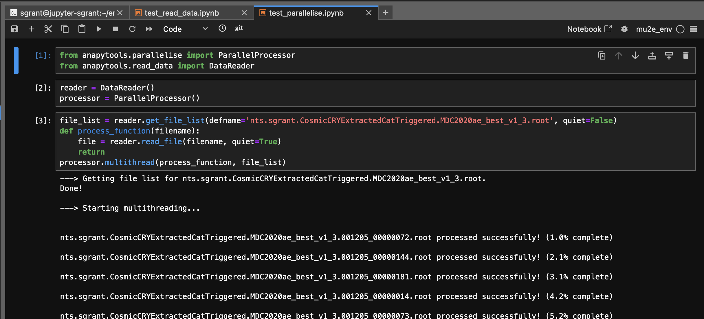

# anapytools

[`anapytools`](https://github.com/Mu2e/anapytools.git) is a custom utilies library installed in `mu2e_env` that allows users to interface with `SAM` and `/pnfs` from EAF, and provides a multithreading tool.

## Setup

```bash
source /cvmfs/mu2e.opensciencegrid.org/setupmu2e-art.sh
kinit ${USER}@FNAL.GOV
/cvmfs/mu2e.opensciencegrid.org/bin/vomsCert
```

## Example Usage 

`anapytools` provides a tool to enable remote access to `/pnfs` using `xroot`, which is not directly accessible from EAF. 

```python
# Create file list from SAM dataset
from anapytools.read_data import DataReader
reader = DataReader()
file_list = reader.get_file_list(defname='nts.mu2e.CeEndpointMix1BBSignal.Tutorial_2024_03.tka')

# Read file from /pnfs using xroot
file = reader.read_file(filename='nts.sgrant.CosmicCRYExtractedCatTriggered.MDC2020ae_best_v1_3.001205_00000000.root')
```

Example of reading data:


In addition `anapytools` provides a tool for mutlithreading, which is extremely useful for running analysis jobs over multiple files. 

```python

# Parallel processing
from anapytools.parallelise import ParallelProcessor
processor = ParallelProcessor()

def process_function(filename):
    file = reader.read_file(filename, quiet=True)
    return

processor.multithread(process_function, file_list)
```

Example of parallel processing:


## Navigation

- Previous: [The Mu2e Python Environment](06-TheMu2eEnvironment.md)
- [Back to Main](../README.md)